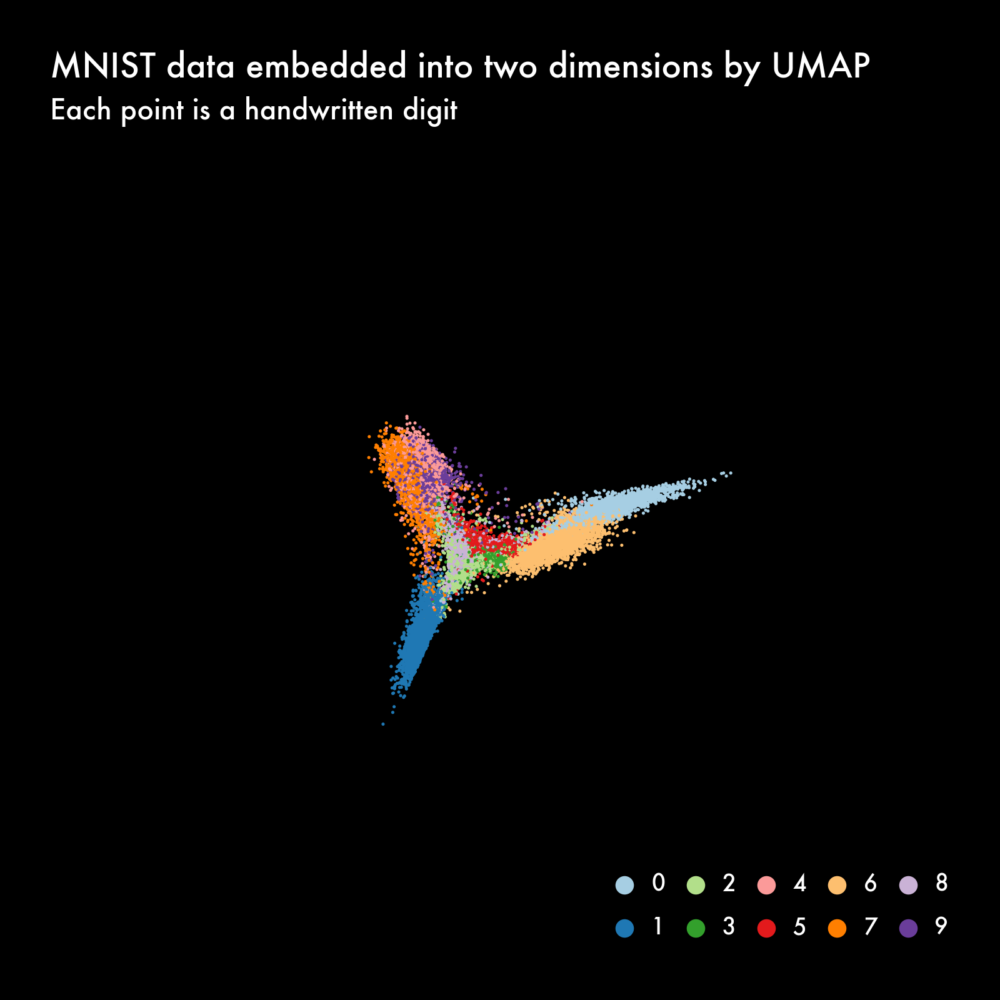
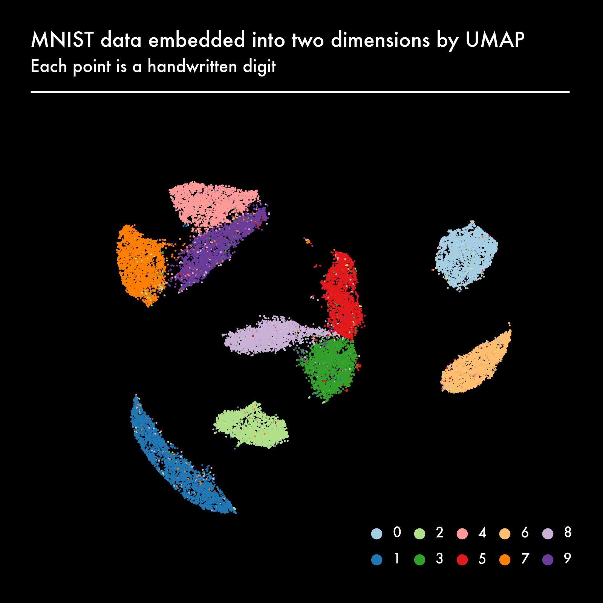
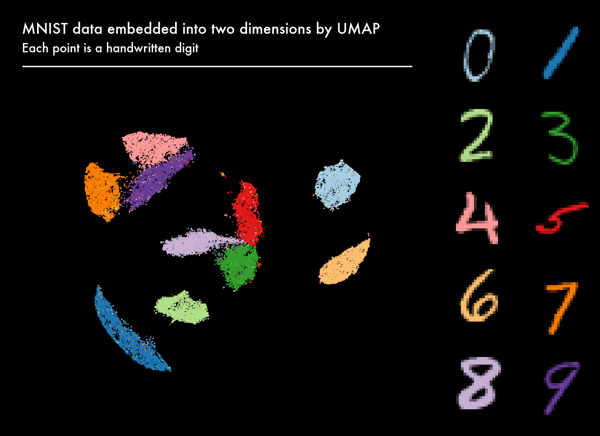

# UMAP Animated


``` python
from plotnine import *
import polars as pl
```

``` python
pl.Config.set_tbl_cols(10)
```

    polars.config.Config

## Understanding handwritten digits as high-dimensional vectors

``` python
df_digits = pl.read_parquet("data/digits.parquet")
df_digits
```

<div>
<small>shape: (30_000, 785)</small>

| pixel1 | pixel2 | pixel3 | pixel4 | pixel5 | …   | pixel781 | pixel782 | pixel783 | pixel784 | digit |
|--------|--------|--------|--------|--------|-----|----------|----------|----------|----------|-------|
| i64    | i64    | i64    | i64    | i64    | …   | i64      | i64      | i64      | i64      | cat   |
| 0      | 0      | 0      | 0      | 0      | …   | 0        | 0        | 0        | 0        | "5"   |
| 0      | 0      | 0      | 0      | 0      | …   | 0        | 0        | 0        | 0        | "0"   |
| 0      | 0      | 0      | 0      | 0      | …   | 0        | 0        | 0        | 0        | "4"   |
| 0      | 0      | 0      | 0      | 0      | …   | 0        | 0        | 0        | 0        | "1"   |
| 0      | 0      | 0      | 0      | 0      | …   | 0        | 0        | 0        | 0        | "9"   |
| …      | …      | …      | …      | …      | …   | …        | …        | …        | …        | …     |
| 0      | 0      | 0      | 0      | 0      | …   | 0        | 0        | 0        | 0        | "8"   |
| 0      | 0      | 0      | 0      | 0      | …   | 0        | 0        | 0        | 0        | "9"   |
| 0      | 0      | 0      | 0      | 0      | …   | 0        | 0        | 0        | 0        | "6"   |
| 0      | 0      | 0      | 0      | 0      | …   | 0        | 0        | 0        | 0        | "7"   |
| 0      | 0      | 0      | 0      | 0      | …   | 0        | 0        | 0        | 0        | "1"   |

</div>

## Plot digits

``` python
def get_pixels(df_, seed=None):
    if seed is not None:
        pl.set_random_seed(seed)
    
    return (
        df_
        .with_row_index()
        .with_columns(pl.col("index").shuffle())
        .sort("index")
        .group_by("digit").first()
        .drop("index")
        .unpivot(index=["digit"])
        .with_columns(pixel=pl.col("variable").str.strip_prefix("pixel").cast(pl.UInt16))
        .with_columns(x=(pl.col("pixel")-1) % 28,
                      y=27-(pl.col("pixel")-1) // 28)
        .drop("variable", "pixel")
    )
```

``` python
df_pixels = get_pixels(df_digits, seed=42)
df_pixels.filter(pl.col("digit") == "7")
```

<div>
<small>shape: (784, 4)</small>

| digit | value | x   | y   |
|-------|-------|-----|-----|
| cat   | i64   | u16 | u16 |
| "7"   | 0     | 0   | 27  |
| "7"   | 0     | 1   | 27  |
| "7"   | 0     | 2   | 27  |
| "7"   | 0     | 3   | 27  |
| "7"   | 0     | 4   | 27  |
| …     | …     | …   | …   |
| "7"   | 0     | 23  | 0   |
| "7"   | 0     | 24  | 0   |
| "7"   | 0     | 25  | 0   |
| "7"   | 0     | 26  | 0   |
| "7"   | 0     | 27  | 0   |

</div>

``` python
with pl.Config(tbl_rows=30, tbl_cols=30):
    display(df_pixels.filter(pl.col("digit") == "7").pivot("x", values="value"))
```

<div>
<small>shape: (28, 30)</small>

| digit | y   | 0   | 1   | 2   | 3   | 4   | 5   | 6   | 7   | 8   | 9   | 10  | 11  | 12  | 13  | 14  | 15  | 16  | 17  | 18  | 19  | 20  | 21  | 22  | 23  | 24  | 25  | 26  | 27  |
|-------|-----|-----|-----|-----|-----|-----|-----|-----|-----|-----|-----|-----|-----|-----|-----|-----|-----|-----|-----|-----|-----|-----|-----|-----|-----|-----|-----|-----|-----|
| cat   | u16 | i64 | i64 | i64 | i64 | i64 | i64 | i64 | i64 | i64 | i64 | i64 | i64 | i64 | i64 | i64 | i64 | i64 | i64 | i64 | i64 | i64 | i64 | i64 | i64 | i64 | i64 | i64 | i64 |
| "7"   | 27  | 0   | 0   | 0   | 0   | 0   | 0   | 0   | 0   | 0   | 0   | 0   | 0   | 0   | 0   | 0   | 0   | 0   | 0   | 0   | 0   | 0   | 0   | 0   | 0   | 0   | 0   | 0   | 0   |
| "7"   | 26  | 0   | 0   | 0   | 0   | 0   | 0   | 0   | 0   | 0   | 0   | 0   | 0   | 0   | 0   | 0   | 0   | 0   | 0   | 0   | 0   | 0   | 0   | 0   | 0   | 0   | 0   | 0   | 0   |
| "7"   | 25  | 0   | 0   | 0   | 0   | 0   | 0   | 0   | 0   | 0   | 0   | 0   | 0   | 0   | 0   | 0   | 0   | 0   | 0   | 0   | 0   | 0   | 0   | 0   | 0   | 0   | 0   | 0   | 0   |
| "7"   | 24  | 0   | 0   | 0   | 0   | 0   | 0   | 0   | 0   | 0   | 0   | 0   | 0   | 0   | 0   | 0   | 0   | 0   | 0   | 0   | 0   | 0   | 0   | 0   | 0   | 0   | 0   | 0   | 0   |
| "7"   | 23  | 0   | 0   | 0   | 0   | 0   | 0   | 0   | 0   | 0   | 0   | 0   | 0   | 0   | 0   | 0   | 0   | 0   | 0   | 0   | 0   | 0   | 0   | 0   | 0   | 0   | 0   | 0   | 0   |
| "7"   | 22  | 0   | 0   | 0   | 0   | 0   | 0   | 0   | 0   | 0   | 0   | 0   | 0   | 0   | 0   | 0   | 0   | 0   | 0   | 0   | 0   | 0   | 0   | 0   | 0   | 0   | 0   | 0   | 0   |
| "7"   | 21  | 0   | 0   | 0   | 0   | 0   | 0   | 0   | 0   | 0   | 0   | 0   | 0   | 0   | 0   | 0   | 0   | 0   | 0   | 0   | 0   | 0   | 0   | 0   | 0   | 0   | 0   | 0   | 0   |
| "7"   | 20  | 0   | 0   | 0   | 0   | 0   | 0   | 0   | 0   | 0   | 0   | 0   | 0   | 0   | 32  | 66  | 160 | 159 | 159 | 187 | 254 | 130 | 0   | 0   | 0   | 0   | 0   | 0   | 0   |
| "7"   | 19  | 0   | 0   | 0   | 0   | 0   | 0   | 0   | 0   | 40  | 184 | 225 | 225 | 225 | 239 | 253 | 254 | 253 | 253 | 253 | 253 | 185 | 0   | 0   | 0   | 0   | 0   | 0   | 0   |
| "7"   | 18  | 0   | 0   | 0   | 0   | 0   | 0   | 0   | 0   | 45  | 240 | 251 | 253 | 253 | 245 | 243 | 150 | 101 | 67  | 253 | 253 | 102 | 0   | 0   | 0   | 0   | 0   | 0   | 0   |
| "7"   | 17  | 0   | 0   | 0   | 0   | 0   | 0   | 0   | 0   | 0   | 32  | 69  | 84  | 84  | 13  | 0   | 0   | 0   | 131 | 253 | 239 | 33  | 0   | 0   | 0   | 0   | 0   | 0   | 0   |
| "7"   | 16  | 0   | 0   | 0   | 0   | 0   | 0   | 0   | 0   | 0   | 0   | 0   | 0   | 0   | 0   | 0   | 0   | 39  | 228 | 253 | 188 | 0   | 0   | 0   | 0   | 0   | 0   | 0   | 0   |
| "7"   | 15  | 0   | 0   | 0   | 0   | 0   | 0   | 0   | 0   | 0   | 0   | 0   | 0   | 0   | 0   | 0   | 0   | 138 | 253 | 247 | 69  | 0   | 0   | 0   | 0   | 0   | 0   | 0   | 0   |
| "7"   | 14  | 0   | 0   | 0   | 0   | 0   | 0   | 0   | 0   | 0   | 0   | 0   | 0   | 0   | 0   | 0   | 23  | 234 | 253 | 146 | 0   | 0   | 0   | 0   | 0   | 0   | 0   | 0   | 0   |
| "7"   | 13  | 0   | 0   | 0   | 0   | 0   | 0   | 0   | 0   | 0   | 0   | 0   | 0   | 0   | 0   | 0   | 122 | 253 | 226 | 34  | 0   | 0   | 0   | 0   | 0   | 0   | 0   | 0   | 0   |
| "7"   | 12  | 0   | 0   | 0   | 0   | 0   | 0   | 0   | 0   | 0   | 0   | 0   | 0   | 0   | 0   | 11  | 240 | 253 | 139 | 0   | 0   | 0   | 0   | 0   | 0   | 0   | 0   | 0   | 0   |
| "7"   | 11  | 0   | 0   | 0   | 0   | 0   | 0   | 0   | 0   | 0   | 0   | 0   | 0   | 0   | 0   | 164 | 254 | 239 | 35  | 0   | 0   | 0   | 0   | 0   | 0   | 0   | 0   | 0   | 0   |
| "7"   | 10  | 0   | 0   | 0   | 0   | 0   | 0   | 0   | 0   | 0   | 0   | 0   | 0   | 0   | 113 | 254 | 255 | 98  | 0   | 0   | 0   | 0   | 0   | 0   | 0   | 0   | 0   | 0   | 0   |
| "7"   | 9   | 0   | 0   | 0   | 0   | 0   | 0   | 0   | 0   | 0   | 0   | 0   | 0   | 9   | 221 | 253 | 181 | 3   | 0   | 0   | 0   | 0   | 0   | 0   | 0   | 0   | 0   | 0   | 0   |
| "7"   | 8   | 0   | 0   | 0   | 0   | 0   | 0   | 0   | 0   | 0   | 0   | 0   | 0   | 203 | 253 | 249 | 56  | 0   | 0   | 0   | 0   | 0   | 0   | 0   | 0   | 0   | 0   | 0   | 0   |
| "7"   | 7   | 0   | 0   | 0   | 0   | 0   | 0   | 0   | 0   | 0   | 0   | 0   | 0   | 209 | 253 | 159 | 0   | 0   | 0   | 0   | 0   | 0   | 0   | 0   | 0   | 0   | 0   | 0   | 0   |
| "7"   | 6   | 0   | 0   | 0   | 0   | 0   | 0   | 0   | 0   | 0   | 0   | 0   | 48  | 249 | 247 | 60  | 0   | 0   | 0   | 0   | 0   | 0   | 0   | 0   | 0   | 0   | 0   | 0   | 0   |
| "7"   | 5   | 0   | 0   | 0   | 0   | 0   | 0   | 0   | 0   | 0   | 0   | 0   | 127 | 253 | 182 | 0   | 0   | 0   | 0   | 0   | 0   | 0   | 0   | 0   | 0   | 0   | 0   | 0   | 0   |
| "7"   | 4   | 0   | 0   | 0   | 0   | 0   | 0   | 0   | 0   | 0   | 0   | 7   | 203 | 253 | 130 | 0   | 0   | 0   | 0   | 0   | 0   | 0   | 0   | 0   | 0   | 0   | 0   | 0   | 0   |
| "7"   | 3   | 0   | 0   | 0   | 0   | 0   | 0   | 0   | 0   | 0   | 0   | 165 | 253 | 240 | 32  | 0   | 0   | 0   | 0   | 0   | 0   | 0   | 0   | 0   | 0   | 0   | 0   | 0   | 0   |
| "7"   | 2   | 0   | 0   | 0   | 0   | 0   | 0   | 0   | 0   | 0   | 23  | 229 | 253 | 117 | 0   | 0   | 0   | 0   | 0   | 0   | 0   | 0   | 0   | 0   | 0   | 0   | 0   | 0   | 0   |
| "7"   | 1   | 0   | 0   | 0   | 0   | 0   | 0   | 0   | 0   | 0   | 13  | 148 | 221 | 30  | 0   | 0   | 0   | 0   | 0   | 0   | 0   | 0   | 0   | 0   | 0   | 0   | 0   | 0   | 0   |
| "7"   | 0   | 0   | 0   | 0   | 0   | 0   | 0   | 0   | 0   | 0   | 0   | 0   | 0   | 0   | 0   | 0   | 0   | 0   | 0   | 0   | 0   | 0   | 0   | 0   | 0   | 0   | 0   | 0   | 0   |

</div>

``` python
def plot_digits(df_, height=3):
    return (
        ggplot(df_, aes("x", "y", alpha="value", fill="digit"))
        + geom_tile()
        + coord_fixed()
        + facet_wrap("digit", ncol=2)
        + guides(alpha=guide_legend(None))
        + scale_alpha_continuous(range=(0, 1))
        + scale_fill_brewer(type="qual", palette=3)
        + theme_void()
        + theme(
            figure_size=(3, height),
            plot_background=element_rect(fill="black"),
            legend_position="none",
            strip_text=element_blank(),
        )
    )
```

``` python
plot_digits(df_pixels.filter(pl.col("digit") == "7"))
```


``` python
plot_digits(df_pixels, height=8)
```


## Plot embedding

``` python
df_epochs = pl.read_parquet("data/epochs.parquet")
df_epochs
```

<div>
<small>shape: (6_000_000, 5)</small>

| index | x        | y        | digit | epoch |
|-------|----------|----------|-------|-------|
| u32   | f32      | f32      | cat   | u16   |
| 0     | 0.481639 | 0.526492 | "5"   | 0     |
| 1     | 0.61237  | 0.573228 | "0"   | 0     |
| 2     | 0.42596  | 0.636468 | "4"   | 0     |
| 3     | 0.400917 | 0.414444 | "1"   | 0     |
| 4     | 0.41914  | 0.602288 | "9"   | 0     |
| …     | …        | …        | …     | …     |
| 29995 | 0.382934 | 0.505783 | "8"   | 199   |
| 29996 | 0.36772  | 0.719987 | "9"   | 199   |
| 29997 | 0.826281 | 0.416917 | "6"   | 199   |
| 29998 | 0.207882 | 0.718433 | "7"   | 199   |
| 29999 | 0.1964   | 0.368493 | "1"   | 199   |

</div>

``` python
num_epochs = df_epochs.select(pl.col("epoch").max()).item() + 1
num_digits = df_epochs.select(pl.col("index").max()).item() + 1
```

``` python
def plot_embedding(df_, epoch, max_epochs, legend=True):
    df_ = (df_.filter(pl.col("epoch") == epoch))
    
    frame = (
        ggplot(df_, aes("x", "y", color="digit"))
        + geom_point(size=0.04, alpha=1)
        + annotate("segment", x=0, y=1.05, xend=epoch/max_epochs, yend=1.05, 
                  color="white", size=1)
        + guides(colour=guide_legend(override_aes={"size": 5, "alpha": 1}))
        + scale_color_brewer(type="qual", palette=3)
        + scale_x_continuous(limits=(0, 1), expand=(0, 0.001, 0, 0.001))
        + scale_y_continuous(limits=(0, 1.06), expand=(0, 0.01, 0, 0.01))
        + labs(title="MNIST data embedded into two dimensions by UMAP",
              subtitle="Each point is a handwritten digit")
        + theme_void(base_size=16, base_family="Futura")
        + theme(
           text=element_text(color="white"),
           plot_title=element_text(ha="left"),
           plot_caption=element_text(ha="left"),
           axis_title=element_blank(),
           axis_text=element_blank(),
           plot_margin=0.05,
           plot_background=element_rect(fill="black"),
           figure_size=(8, 8)
        )
    )

    if legend:
        frame += theme(
            legend_position=(1, 0),
            legend_direction='horizontal',
            legend_title=element_blank(),
        )
    else:
         frame += theme(legend_position="none")
    return frame
```

``` python
plot_embedding(df_epochs, 0, num_epochs)
```



``` python
plot_embedding(df_epochs, num_epochs//4, num_epochs)
```


``` python
plot_embedding(df_epochs, num_epochs-1, num_epochs)
```



## Combine into one picture

``` python
plot_embedding(df_epochs, num_epochs-1, num_epochs, legend=False).save("images/embedding.png", verbose=False)
plot_digits(get_pixels(df_digits, seed=42), height=8).save("images/legend.png", verbose=False)
```

``` python
from PIL import Image

# Open the images
embedding_img = Image.open("images/embedding.png")
legend_img = Image.open("images/legend.png")

# Get the dimensions of the images
embedding_width, embedding_height = embedding_img.size
legend_width, legend_height = legend_img.size

# Create a new image with the combined width and the maximum height of the two images
combined_width = embedding_width + legend_width
combined_height = max(embedding_height, legend_height)
combined_img = Image.new("RGB", (combined_width, combined_height))

# Paste the images into the new image
combined_img.paste(embedding_img, (0, 0))
combined_img.paste(legend_img, (embedding_width, 0))

# Save the combined image
combined_img.save("images/combined.png")
```



## Animate

Need `ffmpeg`

``` python
for i in range(num_epochs):
    print(f"Frame {i}/{num_epochs-1}", end="\r")
    plot_embedding(df_epochs, i, num_epochs, legend=False).save(f"frames/embedding-{i:06}.png", verbose=False)
    plot_digits(get_pixels(df_digits), height=8).save(f"frames/legend-{i:06}.png", verbose=False)
```

    Frame 199/199

``` python
%%bash
ffmpeg \
  -i frames/embedding-%06d.png \
  -i frames/legend-%06d.png \
  -filter_complex "[0:v][1:v]hstack=inputs=2" \
  -framerate 30 \
  -pix_fmt yuv420p \
  -vcodec libx264 \
  -crf 22 \
  -y \
  -loglevel error \
  movies/umap.mp4
```

https://github.com/jeroenjanssens/umap-animated/assets/1368256/cc7aa083-20db-4fe7-9647-98992676ab3c
