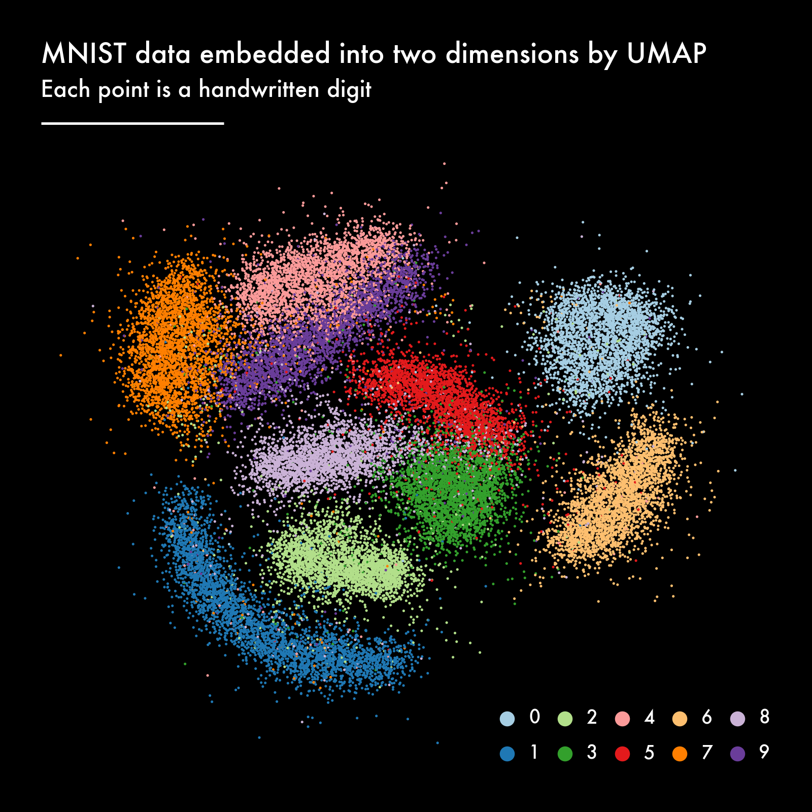

# Dimensionality Reduction, Animated


Understanding your data is key in any data science project.
Visualization is useful for this, but can be challenging when the data
has a high dimensionality. This includes complex data such as text,
images, and sensor measurements. You could create a scatter plot matrix,
but this can only show how any two features interact and fails to
capture structure across many dimensions.

There’s an entire subfield within machine learning concerned with
exactly this challenge: dimensionality reduction. Dimensionality
reduction algorithms can help you gain insight into your
high-dimensional data and reveal whether there’s any structure. The
current state-of-the-art dimensionality reduction algorithm is UMAP,
which stands for Uniform Manifold Approximation and Projection for
Dimension Reduction.

In this post we’re going to apply UMAP to the MNIST dataset, a
collection of 70,000 handwritten digits. Each digit is an image of 28 by
28 grayscale pixels, making the dimensionality of the dataset 784. UMAP
will embed this dataset into two dimensions, allowing us to understand
its structure.

To be honest, the MNIST dataset is already used way too often in machine
learning demos, including those about UMAP. What’s done less often, is
look at *how* UMAP creates an embedding, by visualizing the intermediate
results at every step (also known as an epoch).

## Result

The result of this notebook is an animation where each frame is an
epoch. On the right are random samples of each digit, to give us an idea
of how all the variations look like and to serve as a legend.

``` python
%%HTML
<video alt="test" controls>
    <source src="movies/umap.mp4" type="video/mp4">
</video>
```

<video alt="test" controls>
    <source src="movies/umap.mp4" type="video/mp4">
</video>

https://github.com/jeroenjanssens/umap-animated/assets/1368256/cc7aa083-20db-4fe7-9647-98992676ab3c

There are a couple of interesting things to note:

- UMAP has a decent embedding already after a couple of epochs.
- The long shape of cluster “1” is probably because the way a “1” is
  written, depends mostly on the angle. Other digits have more degrees
  of freedom.
- The clusters “3”, “5”, “8” are close together. Probably because
  they’re often confused.
- The same can be said for clusters “4”, “7”, and “9”.
- Towards the end of the optimization the noisiness is reduced.

## Applying UMAP

The notebook *prepare.ipynb* applies UMAP and prepares the data
necessary to generate the visualizations and animations. It creates two
files: *data/digits.parquet* and *data/epochs.parquet*. Because these
two files are already present in the repository, you don’t necessarily
need to run this notebook.

``` python
from plotnine import *
import polars as pl

from util import combine_plots

pl.Config.set_tbl_cols(10);
```

## Understanding handwritten digits as high-dimensional vectors

Machine learning algorithms, such as UMAP, assume that each row is a
data point. That means that one hand-written digit is a row of 784
values, in other words, a high-dimensional vector. The values, by the
way, vary from 0 to 255 to represent the amount of ink. Here’s a portion
of the very wide DataFrame `df_digits`.

``` python
df_digits = pl.read_parquet("data/digits.parquet")
df_digits
```

<div>
<small>shape: (30_000, 785)</small>

| pixel1 | pixel2 | pixel3 | pixel4 | pixel5 | …   | pixel781 | pixel782 | pixel783 | pixel784 | digit |
|--------|--------|--------|--------|--------|-----|----------|----------|----------|----------|-------|
| i64    | i64    | i64    | i64    | i64    | …   | i64      | i64      | i64      | i64      | cat   |
| 0      | 0      | 0      | 0      | 0      | …   | 0        | 0        | 0        | 0        | "5"   |
| 0      | 0      | 0      | 0      | 0      | …   | 0        | 0        | 0        | 0        | "0"   |
| 0      | 0      | 0      | 0      | 0      | …   | 0        | 0        | 0        | 0        | "4"   |
| 0      | 0      | 0      | 0      | 0      | …   | 0        | 0        | 0        | 0        | "1"   |
| 0      | 0      | 0      | 0      | 0      | …   | 0        | 0        | 0        | 0        | "9"   |
| …      | …      | …      | …      | …      | …   | …        | …        | …        | …        | …     |
| 0      | 0      | 0      | 0      | 0      | …   | 0        | 0        | 0        | 0        | "8"   |
| 0      | 0      | 0      | 0      | 0      | …   | 0        | 0        | 0        | 0        | "9"   |
| 0      | 0      | 0      | 0      | 0      | …   | 0        | 0        | 0        | 0        | "6"   |
| 0      | 0      | 0      | 0      | 0      | …   | 0        | 0        | 0        | 0        | "7"   |
| 0      | 0      | 0      | 0      | 0      | …   | 0        | 0        | 0        | 0        | "1"   |

</div>

Our goal is to reduce the dimensionality from 784 to 2, so that we can
create a scatter plot.

## Plot digits

To better understanding what the handwritten digits actually look like,
we can visualize them using Plotnine. For this, we need to wrangle a
wide row into a long DataFrame of `x` and `y` values.

``` python
def get_pixels(df_, seed=None):
    if seed is not None:
        pl.set_random_seed(seed)
    
    return (
        df_
        .with_row_index()
        .with_columns(pl.col("index").shuffle())
        .sort("index")
        .group_by("digit").first()
        .drop("index")
        .unpivot(index=["digit"])
        .with_columns(pixel=pl.col("variable").str.strip_prefix("pixel").cast(pl.UInt16))
        .with_columns(x=(pl.col("pixel")-1) % 28,
                      y=27-(pl.col("pixel")-1) // 28)
        .drop("variable", "pixel")
    )
```

Here’s what the result looks like for a hand-written “7”:

``` python
df_pixels = get_pixels(df_digits, seed=42)
df_pixels.filter(pl.col("digit") == "7")
```

<div>
<small>shape: (784, 4)</small>

| digit | value | x   | y   |
|-------|-------|-----|-----|
| cat   | i64   | u16 | u16 |
| "7"   | 0     | 0   | 27  |
| "7"   | 0     | 1   | 27  |
| "7"   | 0     | 2   | 27  |
| "7"   | 0     | 3   | 27  |
| "7"   | 0     | 4   | 27  |
| …     | …     | …   | …   |
| "7"   | 0     | 23  | 0   |
| "7"   | 0     | 24  | 0   |
| "7"   | 0     | 25  | 0   |
| "7"   | 0     | 26  | 0   |
| "7"   | 0     | 27  | 0   |

</div>

If we make this long DataFrame square, and squint our eyes, we can
actually see a “7”:

``` python
with pl.Config(tbl_rows=30, tbl_cols=30):
    display(df_pixels.filter(pl.col("digit") == "7").pivot("x", values="value"))
```

<div>
<small>shape: (28, 30)</small>

| digit | y   | 0   | 1   | 2   | 3   | 4   | 5   | 6   | 7   | 8   | 9   | 10  | 11  | 12  | 13  | 14  | 15  | 16  | 17  | 18  | 19  | 20  | 21  | 22  | 23  | 24  | 25  | 26  | 27  |
|-------|-----|-----|-----|-----|-----|-----|-----|-----|-----|-----|-----|-----|-----|-----|-----|-----|-----|-----|-----|-----|-----|-----|-----|-----|-----|-----|-----|-----|-----|
| cat   | u16 | i64 | i64 | i64 | i64 | i64 | i64 | i64 | i64 | i64 | i64 | i64 | i64 | i64 | i64 | i64 | i64 | i64 | i64 | i64 | i64 | i64 | i64 | i64 | i64 | i64 | i64 | i64 | i64 |
| "7"   | 27  | 0   | 0   | 0   | 0   | 0   | 0   | 0   | 0   | 0   | 0   | 0   | 0   | 0   | 0   | 0   | 0   | 0   | 0   | 0   | 0   | 0   | 0   | 0   | 0   | 0   | 0   | 0   | 0   |
| "7"   | 26  | 0   | 0   | 0   | 0   | 0   | 0   | 0   | 0   | 0   | 0   | 0   | 0   | 0   | 0   | 0   | 0   | 0   | 0   | 0   | 0   | 0   | 0   | 0   | 0   | 0   | 0   | 0   | 0   |
| "7"   | 25  | 0   | 0   | 0   | 0   | 0   | 0   | 0   | 0   | 0   | 0   | 0   | 0   | 0   | 0   | 0   | 0   | 0   | 0   | 0   | 0   | 0   | 0   | 0   | 0   | 0   | 0   | 0   | 0   |
| "7"   | 24  | 0   | 0   | 0   | 0   | 0   | 0   | 0   | 0   | 0   | 0   | 0   | 0   | 0   | 0   | 0   | 0   | 0   | 0   | 0   | 0   | 0   | 0   | 0   | 0   | 0   | 0   | 0   | 0   |
| "7"   | 23  | 0   | 0   | 0   | 0   | 0   | 0   | 0   | 0   | 0   | 0   | 0   | 0   | 0   | 0   | 0   | 0   | 0   | 0   | 0   | 0   | 0   | 0   | 0   | 0   | 0   | 0   | 0   | 0   |
| "7"   | 22  | 0   | 0   | 0   | 0   | 0   | 0   | 0   | 0   | 0   | 0   | 0   | 0   | 0   | 0   | 0   | 0   | 0   | 0   | 0   | 0   | 0   | 0   | 0   | 0   | 0   | 0   | 0   | 0   |
| "7"   | 21  | 0   | 0   | 0   | 0   | 0   | 0   | 0   | 0   | 0   | 0   | 0   | 0   | 0   | 0   | 0   | 0   | 0   | 0   | 0   | 0   | 0   | 0   | 0   | 0   | 0   | 0   | 0   | 0   |
| "7"   | 20  | 0   | 0   | 0   | 0   | 0   | 0   | 0   | 0   | 0   | 0   | 0   | 0   | 0   | 32  | 66  | 160 | 159 | 159 | 187 | 254 | 130 | 0   | 0   | 0   | 0   | 0   | 0   | 0   |
| "7"   | 19  | 0   | 0   | 0   | 0   | 0   | 0   | 0   | 0   | 40  | 184 | 225 | 225 | 225 | 239 | 253 | 254 | 253 | 253 | 253 | 253 | 185 | 0   | 0   | 0   | 0   | 0   | 0   | 0   |
| "7"   | 18  | 0   | 0   | 0   | 0   | 0   | 0   | 0   | 0   | 45  | 240 | 251 | 253 | 253 | 245 | 243 | 150 | 101 | 67  | 253 | 253 | 102 | 0   | 0   | 0   | 0   | 0   | 0   | 0   |
| "7"   | 17  | 0   | 0   | 0   | 0   | 0   | 0   | 0   | 0   | 0   | 32  | 69  | 84  | 84  | 13  | 0   | 0   | 0   | 131 | 253 | 239 | 33  | 0   | 0   | 0   | 0   | 0   | 0   | 0   |
| "7"   | 16  | 0   | 0   | 0   | 0   | 0   | 0   | 0   | 0   | 0   | 0   | 0   | 0   | 0   | 0   | 0   | 0   | 39  | 228 | 253 | 188 | 0   | 0   | 0   | 0   | 0   | 0   | 0   | 0   |
| "7"   | 15  | 0   | 0   | 0   | 0   | 0   | 0   | 0   | 0   | 0   | 0   | 0   | 0   | 0   | 0   | 0   | 0   | 138 | 253 | 247 | 69  | 0   | 0   | 0   | 0   | 0   | 0   | 0   | 0   |
| "7"   | 14  | 0   | 0   | 0   | 0   | 0   | 0   | 0   | 0   | 0   | 0   | 0   | 0   | 0   | 0   | 0   | 23  | 234 | 253 | 146 | 0   | 0   | 0   | 0   | 0   | 0   | 0   | 0   | 0   |
| "7"   | 13  | 0   | 0   | 0   | 0   | 0   | 0   | 0   | 0   | 0   | 0   | 0   | 0   | 0   | 0   | 0   | 122 | 253 | 226 | 34  | 0   | 0   | 0   | 0   | 0   | 0   | 0   | 0   | 0   |
| "7"   | 12  | 0   | 0   | 0   | 0   | 0   | 0   | 0   | 0   | 0   | 0   | 0   | 0   | 0   | 0   | 11  | 240 | 253 | 139 | 0   | 0   | 0   | 0   | 0   | 0   | 0   | 0   | 0   | 0   |
| "7"   | 11  | 0   | 0   | 0   | 0   | 0   | 0   | 0   | 0   | 0   | 0   | 0   | 0   | 0   | 0   | 164 | 254 | 239 | 35  | 0   | 0   | 0   | 0   | 0   | 0   | 0   | 0   | 0   | 0   |
| "7"   | 10  | 0   | 0   | 0   | 0   | 0   | 0   | 0   | 0   | 0   | 0   | 0   | 0   | 0   | 113 | 254 | 255 | 98  | 0   | 0   | 0   | 0   | 0   | 0   | 0   | 0   | 0   | 0   | 0   |
| "7"   | 9   | 0   | 0   | 0   | 0   | 0   | 0   | 0   | 0   | 0   | 0   | 0   | 0   | 9   | 221 | 253 | 181 | 3   | 0   | 0   | 0   | 0   | 0   | 0   | 0   | 0   | 0   | 0   | 0   |
| "7"   | 8   | 0   | 0   | 0   | 0   | 0   | 0   | 0   | 0   | 0   | 0   | 0   | 0   | 203 | 253 | 249 | 56  | 0   | 0   | 0   | 0   | 0   | 0   | 0   | 0   | 0   | 0   | 0   | 0   |
| "7"   | 7   | 0   | 0   | 0   | 0   | 0   | 0   | 0   | 0   | 0   | 0   | 0   | 0   | 209 | 253 | 159 | 0   | 0   | 0   | 0   | 0   | 0   | 0   | 0   | 0   | 0   | 0   | 0   | 0   |
| "7"   | 6   | 0   | 0   | 0   | 0   | 0   | 0   | 0   | 0   | 0   | 0   | 0   | 48  | 249 | 247 | 60  | 0   | 0   | 0   | 0   | 0   | 0   | 0   | 0   | 0   | 0   | 0   | 0   | 0   |
| "7"   | 5   | 0   | 0   | 0   | 0   | 0   | 0   | 0   | 0   | 0   | 0   | 0   | 127 | 253 | 182 | 0   | 0   | 0   | 0   | 0   | 0   | 0   | 0   | 0   | 0   | 0   | 0   | 0   | 0   |
| "7"   | 4   | 0   | 0   | 0   | 0   | 0   | 0   | 0   | 0   | 0   | 0   | 7   | 203 | 253 | 130 | 0   | 0   | 0   | 0   | 0   | 0   | 0   | 0   | 0   | 0   | 0   | 0   | 0   | 0   |
| "7"   | 3   | 0   | 0   | 0   | 0   | 0   | 0   | 0   | 0   | 0   | 0   | 165 | 253 | 240 | 32  | 0   | 0   | 0   | 0   | 0   | 0   | 0   | 0   | 0   | 0   | 0   | 0   | 0   | 0   |
| "7"   | 2   | 0   | 0   | 0   | 0   | 0   | 0   | 0   | 0   | 0   | 23  | 229 | 253 | 117 | 0   | 0   | 0   | 0   | 0   | 0   | 0   | 0   | 0   | 0   | 0   | 0   | 0   | 0   | 0   |
| "7"   | 1   | 0   | 0   | 0   | 0   | 0   | 0   | 0   | 0   | 0   | 13  | 148 | 221 | 30  | 0   | 0   | 0   | 0   | 0   | 0   | 0   | 0   | 0   | 0   | 0   | 0   | 0   | 0   | 0   |
| "7"   | 0   | 0   | 0   | 0   | 0   | 0   | 0   | 0   | 0   | 0   | 0   | 0   | 0   | 0   | 0   | 0   | 0   | 0   | 0   | 0   | 0   | 0   | 0   | 0   | 0   | 0   | 0   | 0   | 0   |

</div>

However, we have Plotnine at our disposal, so let’s use that instead.
The following function uses the `geom_tile()` and `facet_wrap()`
functions. We’re going to use it to create a legend of all 10 digits.

``` python
def plot_digits(df_, height=3):
    return (
        ggplot(df_, aes("x", "y", alpha="value", fill="digit"))
        + geom_tile()
        + coord_fixed()
        + facet_wrap("digit", ncol=2)
        + guides(alpha=guide_legend(None))
        + scale_alpha_continuous(range=(0, 1))
        + scale_fill_brewer(type="qual", palette=3)
        + theme_void()
        + theme(
            figure_size=(3, height),
            plot_background=element_rect(fill="black"),
            legend_position="none",
            strip_text=element_blank(),
        )
    )
```

``` python
plot_digits(df_pixels.filter(pl.col("digit") == "7"))
```


``` python
plot_digits(df_pixels, height=8)
```


Note that we’re using an unsupervised algorithm here, meaning that UMAP
doesn’t know which high-dimensional vector belongs to which digit. The
coloring is only used for visualization purposes.

## Plot embedding

To plot an embedding, we’re going to read the Parquet file
*data/epochs.parquet* into a DataFrame called `df_epochs`. This is a
very long DataFrame containing the `x` and `y` position of each digit at
every epoch.

``` python
df_epochs = pl.read_parquet("data/epochs.parquet")
df_epochs
```

<div>
<small>shape: (6_000_000, 5)</small>

| index | x        | y        | digit | epoch |
|-------|----------|----------|-------|-------|
| u32   | f32      | f32      | cat   | u16   |
| 0     | 0.481639 | 0.526492 | "5"   | 0     |
| 1     | 0.61237  | 0.573228 | "0"   | 0     |
| 2     | 0.42596  | 0.636468 | "4"   | 0     |
| 3     | 0.400917 | 0.414444 | "1"   | 0     |
| 4     | 0.41914  | 0.602288 | "9"   | 0     |
| …     | …        | …        | …     | …     |
| 29995 | 0.382934 | 0.505783 | "8"   | 199   |
| 29996 | 0.36772  | 0.719987 | "9"   | 199   |
| 29997 | 0.826281 | 0.416917 | "6"   | 199   |
| 29998 | 0.207882 | 0.718433 | "7"   | 199   |
| 29999 | 0.1964   | 0.368493 | "1"   | 199   |

</div>

From the 60,000 available digits, we use 30,000 of them. We let UMAP
optimize for 200 epochs. This is to keep the final animation below 10MB
so that GitHub can include it in the README.

``` python
num_digits = df_epochs.select(pl.col("index").max()).item() + 1
num_epochs = df_epochs.select(pl.col("epoch").max()).item() + 1
```

The following function creates a scatter plot using the `geom_point()`
function. The `max_epoch` argument is used to add a progress bar (using
the `annotate()` function) underneath the title. The majority of the
code is responsible for styling the plot. The `legend` argument is set
to `False` when we combine the scatter plot with the visualizations of
the digits show above. The `dpi` argument is only used to create the
small image at the beginning of this notebook.

``` python
def plot_embedding(df_, epoch, max_epochs, legend=True, dpi=100):
    df_ = (df_.filter(pl.col("epoch") == epoch))
    
    frame = (
        ggplot(df_, aes("x", "y", color="digit"))
        + geom_point(size=0.04, alpha=1)
        + annotate("segment", x=0, y=1.05, xend=epoch/max_epochs, yend=1.05, 
                   color="white", size=1)
        + guides(colour=guide_legend(override_aes={"size": 5, "alpha": 1}))
        + scale_color_brewer(type="qual", palette=3)
        + scale_x_continuous(limits=(0, 1), expand=(0, 0.001, 0, 0.001))
        + scale_y_continuous(limits=(0, 1.06), expand=(0, 0.01, 0, 0.01))
        + labs(title="MNIST data embedded into two dimensions by UMAP",
               subtitle="Each point is a handwritten digit")
        + theme_void(base_size=16, base_family="Futura")
        + theme(
            text=element_text(color="white"),
            plot_title=element_text(ha="left"),
            plot_caption=element_text(ha="left"),
            axis_title=element_blank(),
            axis_text=element_blank(),
            plot_margin=0.05,
            plot_background=element_rect(fill="black"),
            figure_size=(8, 8),
            dpi=dpi
        )
    )

    if legend:
        frame += theme(
            legend_position=(1, 0),
            legend_direction='horizontal',
            legend_title=element_blank(),
        )
    else:
         frame += theme(legend_position="none")
    return frame
```

``` python
# Create a small image to add to the beginning of this notebook
plot_embedding(df_epochs, num_epochs-1, num_epochs, legend=True, dpi=50).save("images/intro.png", verbose=False)
```

### Initial embedding

UMAP begins by constructing a weighted k-nearest neighbor graph from the
high-dimensional data. It then performs spectral embedding, which
involves computing the eigenvectors of the graph Laplacian. This step
provides an initial low-dimensional representation of the data.

``` python
plot_embedding(df_epochs, 0, num_epochs)
```


### Intermediate embeddings

After the spectral embedding, UMAP refines the embedding using a
non-linear optimization technique. It minimizes a cross-entropy loss
function that aligns the high-dimensional data structure with the
low-dimensional representation. This optimization is done using
stochastic gradient descent.

``` python
plot_embedding(df_epochs, num_epochs//4, num_epochs)
```



### Final embedding

As the optimization progresses, the algorithm approaches a local minimum
of the loss function. The gradients of the loss function become smaller,
leading to smaller updates to the embeddings. This is a natural part of
gradient-based optimization processes, where convergence typically slows
as the solution nears the optimum.

``` python
plot_embedding(df_epochs, num_epochs-1, num_epochs)
```


## Combine the embedding and the legend into one picture

We use the function `combine_plots()` from *utils.py* to put the
embedding and the legend next to each other.

``` python
combine_plots([
    plot_embedding(df_epochs, num_epochs-1, num_epochs, legend=False),
    plot_digits(get_pixels(df_digits, seed=42), height=8)
], "images/combined.png", orientation="horizontal")
```


## Animate

To create the animation, we first generate all the frames as individual
PNG files.

``` python
for i in range(num_epochs):
    combine_plots([
        plot_embedding(df_epochs, i, num_epochs, legend=False),
        plot_digits(get_pixels(df_digits), height=8)
    ], f"frames/combined-{i:06}.png", orientation="horizontal")
```

We then use `ffmpeg` to stitch the 200 PNG files into an MP4 movie.
(Plotnine offers a
[PlotnineAnimation](https://plotnine.org/reference/PlotnineAnimation.html)
class to animate ggplot objects, but it currently [has some
issues](https://github.com/has2k1/plotnine/issues/816).)

The most important argument is `-i`, which specifies the PNG files. The
arguments `-pix_fmt`, `-vcodec`, and `-crf` define the video encoding
and compression. The argument `-y` causes `ffmpeg` to override existing
files.

``` python
%%bash
ffmpeg \
  -i frames/combined-%06d.png \
  -framerate 30 \
  -pix_fmt yuv420p \
  -vcodec libx264 \
  -crf 22 \
  -y \
  -loglevel error \
  movies/umap.mp4
```

## Final result

``` python
%%HTML
<video alt="test" controls>
    <source src="movies/umap.mp4" type="video/mp4">
</video>
```

<video alt="test" controls>
    <source src="movies/umap.mp4" type="video/mp4">
</video>

https://github.com/jeroenjanssens/umap-animated/assets/1368256/cc7aa083-20db-4fe7-9647-98992676ab3c

## Conclusion

There are a couple of interesting things to note about this animation:

- UMAP has a decent embedding already after a couple of epochs.
- The long shape of cluster “1” is probably because the way a “1” is
  written, depends mostly on the angle. Other digits have more degrees
  of freedom.
- The clusters “3”, “5”, “8” are close together. Probably because
  they’re often confused.
- The same can be said for clusters “4”, “7”, and “9”.
- Towards the end of the optimization the noisiness is reduced.

This animation suggests that visualizing and animating intermediate
results of otherwise complicated algorithms can help us understand them.
They can be complementary to the math and the implementation of the
algorithms.

## References

- [UMAP](https://umap-learn.readthedocs.io/en/latest/)
- [Forked version of UMAP that saves intermediate
  embeddings](https://github.com/jeroenjanssens/umap)
- [MNIST Database](https://en.wikipedia.org/wiki/MNIST_database)
- [ffmpeg](https://ffmpeg.org/)
